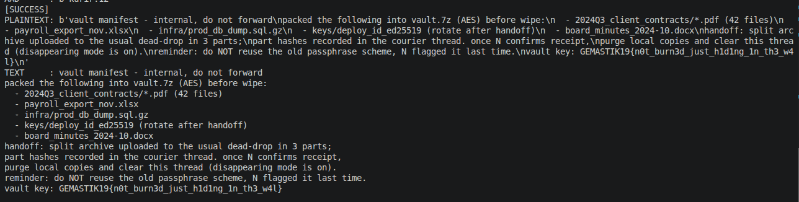

# Cinder

## Deskripsi

Challenge memberikan berkas `forensic.zip` yang berisi direktori data aplikasi chat `com.example.cinder`:
```
com.example.cinder/
├── databases/
│   ├── chat.db
│   ├── chat.db-wal
│   └── chat.db-shm
└── shared_prefs/
    └── secure_prefs.xml
```

## Penyelesaian

### 1. Analisis Database Utama (`chat.db`)
Pada tabel `drafts`, ditemukan decoy flag:
```
GEMASTIK{th1s_dr4ft_n0t3_1s_4_d3c0y}
```
Pesan pada tabel `messages` terenkripsi dalam format binary pada kolom `body`.

### 2. Parameter Enkripsi (`secure_prefs.xml`)
Berkas ini menyimpan konfigurasi dekripsi:
* `install_key`: `zFQ9GVudkfiHhytpG1zAl2B+DHLhE650mzYFCL+pqSI=` (Base64)
* `kdf_salt`: `5n581xQBvjFW5FFDwj2stw==` (Base64)
* `kdf_iters`: `120000` (PBKDF2-SHA256)
* `msg_cipher`: `AES-256-GCM`
* `aead_aad`: `thread:rowid`

### 3. Analisis WAL (`chat.db-wal`) & Rekonstruksi Database
Pemeriksaan WAL menunjukkan adanya thread terhapus bernama `kurir` yang tidak tampil di database utama. Karena data dihapus/ditimpa secara logis pada frame WAL akhir, database harus direkonstruksi secara manual menggunakan frame transaksi lama (Frame 1 sampai 5) agar data `kurir` (khususnya RowID 12) tetap terjaga di dalam `snapshot_A.db`.

Script untuk merekonstruksi `snapshot_A.db`:
```python
import struct

# Load original database
with open("com.example.cinder/databases/chat.db", "rb") as f:
    db_data = bytearray(f.read())

# Load WAL frames
with open("com.example.cinder/databases/chat.db-wal", "rb") as f:
    f.seek(32) # Skip header
    frames = []
    while True:
        fh = f.read(24)
        if not fh: break
        page_num, _ = struct.unpack(">II", fh[:8])
        page_data = f.read(512)
        frames.append((page_num, page_data))

# Tulis frame dari transaksi lama (Frame 1-5)
reconstructed_pages = {
    1: frames[0][1], # Frame 1
    2: frames[1][1], # Frame 2 (Menghubungkan ke tabel messages kurir)
    4: frames[2][1], # Frame 3
    5: frames[3][1], # Frame 4 (Menyimpan data kurir)
    6: frames[4][1], # Frame 5 (Overflow)
}

for page_num, page_data in reconstructed_pages.items():
    required_size = page_num * 512
    if len(db_data) < required_size:
        db_data.extend(b"\x00" * (required_size - len(db_data)))
    db_data[(page_num - 1) * 512 : page_num * 512] = page_data

with open("snapshot_A.db", "wb") as f:
    f.write(db_data)
```

Setelah `snapshot_A.db` terbentuk, query pencarian pada thread `kurir` akan menghasilkan:
```sql
SELECT id, thread, ts, state, length(body) FROM messages WHERE thread='kurir';
-- 10|kurir|1723640100|1|78
-- 11|kurir|1723640200|1|73
-- 12|kurir|1723640260|1|654  <-- Mencurigakan (ukuran besar)
-- 13|kurir|1723640300|1|70
```

### 4. Struktur Pesan & Dekripsi
Kolom `body` mengikuti struktur protobuf:
* `0A <sender_len> <sender>`
* `12 0C <12-byte nonce>`
* `1A <varint_ciphertext_len> <ciphertext>`
* `22 10 <16-byte GCM tag>`

Untuk message ID 12:
* AAD: `kurir:12` (format `thread:rowid`)

### Script Solver (`solve.py`)
Script ini membaca database `snapshot_A.db`, mem-parse kolom binary `body`, dan mendekripsi pesan tersembunyi.

```python
import sqlite3
import base64
import hashlib
from cryptography.hazmat.primitives.ciphers.aead import AESGCM

INSTALL_KEY_B64 = "zFQ9GVudkfiHhytpG1zAl2B+DHLhE650mzYFCL+pqSI="
SALT_B64 = "5n581xQBvjFW5FFDwj2stw=="
ITERATIONS = 120000

install_key = base64.b64decode(INSTALL_KEY_B64)
salt = base64.b64decode(SALT_B64)

key = hashlib.pbkdf2_hmac(
    "sha256",
    install_key,
    salt,
    ITERATIONS,
    32
)

def parse_body(body):
    pos = 0

    assert body[pos] == 0x0a
    sender_len = body[pos + 1]
    pos += 2

    sender = body[pos:pos + sender_len]
    pos += sender_len

    assert body[pos] == 0x12
    assert body[pos + 1] == 0x0c
    pos += 2

    nonce = body[pos:pos + 12]
    pos += 12

    assert body[pos] == 0x1a
    pos += 1

    length = 0
    shift = 0

    while True:
        x = body[pos]
        pos += 1

        length |= (x & 0x7f) << shift

        if not (x & 0x80):
            break

        shift += 7

    ciphertext = body[pos:pos + length]
    pos += length

    assert body[pos] == 0x22
    assert body[pos + 1] == 0x10
    pos += 2

    tag = body[pos:pos + 16]
    pos += 16

    assert pos == len(body)

    return sender, nonce, ciphertext, tag


db = sqlite3.connect("snapshot_A.db")

rows = db.execute("""
    SELECT id, thread, ts, state, body
    FROM messages
    WHERE thread='kurir'
    ORDER BY id
""").fetchall()

aes = AESGCM(key)

for id_, thread, ts, state, body in rows:
    sender, nonce, ciphertext, tag = parse_body(body)
    encrypted = ciphertext + tag
    aad = f"{thread}:{id_}".encode()

    try:
        plaintext = aes.decrypt(
            nonce,
            encrypted,
            aad
        )
        print(f"\n[+] ID: {id_} | Thread: {thread}")
        print(plaintext.decode(errors="replace"))
    except Exception as e:
        print(f"[-] ID: {id_} decryption failed: {e}")
```

Script behasil dan menunjukkan pesan PLAINTEXT yang diahiri dengan flag dari challange cinder.




## Flag
```
GEMASTIK19{n0t_burn3d_just_h1d1ng_1n_th3_w4l}
```
