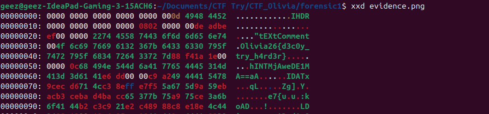
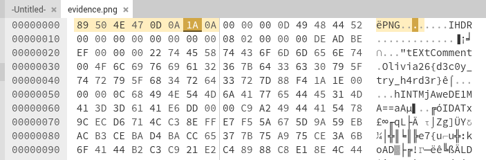
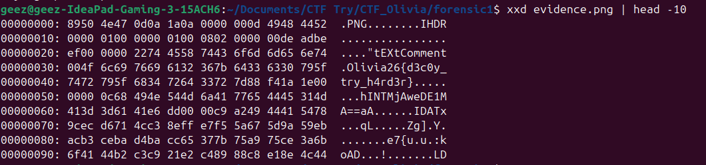
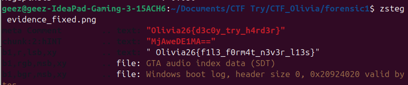

# Corrupt Evidence Wirite-Up 


Kami diberikan file `evidence.png` yang tidak bisa dibuka. Tugasnya adalah memperbaiki file tersebut dan menemukan flag yang tersembunyi di dalamnya.

## Analisis

Langkah pertama adalah mengidentifikasi kerusakan file dengan melihat raw bytes menggunakan `xxd`.



Saya menemukan bahwa hex tidak sesuai dan saya mencobanya untuk menggantinya menjadi PNG dengan hex editor sesuai dengan daftar yang tersedia di website https://filesig.search.org/




Setelah file bisa dibuka, dilakukan parsing semua chunk PNG untuk mencari data tersembunyi.

Chunk yang ditemukan:

- `IHDR` — Width=200, Height=150, 8-bit RGB
- `tEXt` — Comment: `Olivia26{d3c0y_try_h4rd3r}` ← **DECOY**
- `hINT` — `MjAweDE1MA==` (Base64)
- `IDAT` — Pixel data terkompresi
- `IEND` — End marker



### Decode chunk hINT

```bash
$ echo "MjAweDE1MA==" | base64 -d
200x150
```

Chunk `hINT` berisi hint dimensi asli gambar: `200x150`, mengkonfirmasi nilai yang benar.

Menggunakan `zsteg` untuk mendeteksi steganografi pada pixel gambar:



## Flag

Flag diambil dari data tersembunyi pada pixel gambar yang terdeteksi melalui `zsteg`. Perhatikan bahwa flag di dalam chunk `tEXt` (`Olivia26{d3c0y_try_h4rd3r}`) hanyalah **umpan (decoy)**.

```
Olivia26{f1l3_f0rm4t_n3v3r_l13s}
```
