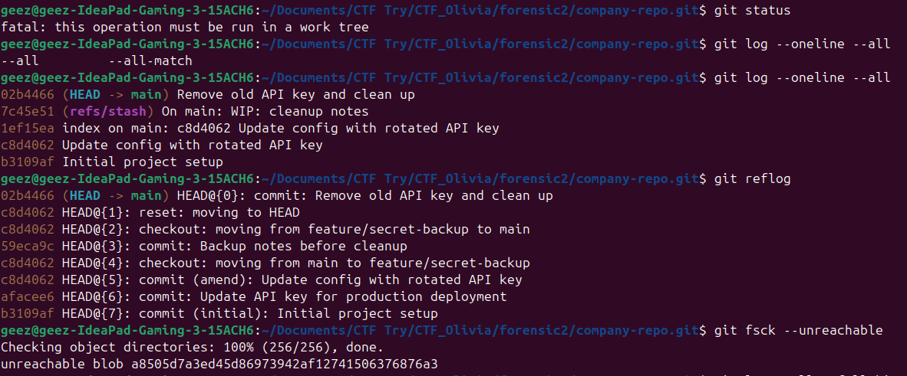
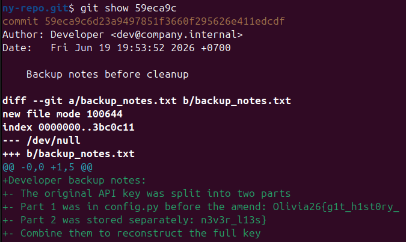

# Git Never Forgets


A developer accidentally committed a production API key to the company's internal repository. Realizing the mistake, they tried to erase it — amending the commit, rewriting history, and even deleting the backup branch. But Git remembers everything. Analyze this repository to uncover the supposedly deleted API key.

## Analisis

Soal menyebutkan bahwa developer mencoba menghapus API key dengan cara:

- Amending commit — menimpa commit terakhir agar API key tidak terlihat
- Rewriting history — mengubah isi riwayat commit
- Deleting backup branch — menghapus branch cadangan yang menyimpan catatan

Kunci dari soal ini adalah: Git tidak benar-benar menghapus object commit saat di-amend atau branch dihapus. Object lama tetap tersimpan dan bisa ditemukan melalui `git reflog`.

## Penyelesaian





Ada dua commit mencurigakan:

- `afacee6` — commit asli sebelum di-amend
- `59eca9c` — commit di branch `feature/secret-backup` yang sudah dihapus




Ditemukan **flag part 1 dan 2 dalam 59eca9c** 

- `Part 1` (commit sebelum amend) : `Olivia26{g1t_h1st0ry_`
- `Part 2` (commit branch terhapus): `n3v3r_l13s}`

## Flag

```
Olivia26{g1t_h1st0ry_n3v3r_l13s}
```