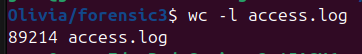
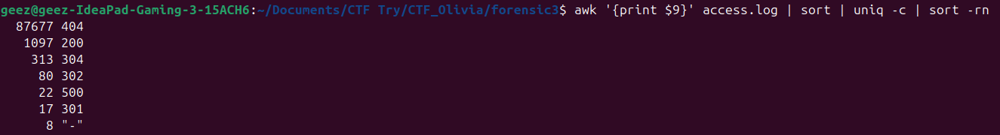
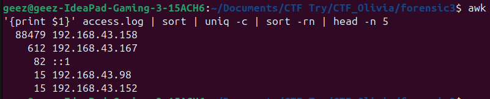
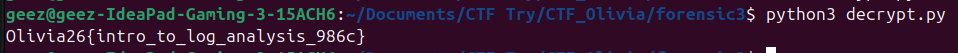

# Web Access Log Analysis


Andy is developing a website and this is his first time to develop a website. Before the website can be deployed into production, he needs to test the features and performance of this website. He asked a penetration tester to test the security of the website he developed. The penetration tester managed to identify the vulnerabilities in the website and left a message, proving the vulnerability he found were valid. Can you find that message?

**File yang diberikan:** `access.log` — Apache web server access log (~14 MB)

## Penyelesaian







Terdapat 87.677 request 404 — indikasi scanning besar-besaran oleh pentester.





IP paling aktif dan melakukan request tidak wajar adalah `192.168.43.158` (Linux/Firefox). Aktivitas dimulai normal (browsing website), kemudian beralih ke aktivitas mencurigakan.

## Analisis Timeline Serangan Pentester

Ringkasan kronologis aktivitas attacker (`192.168.43.158`) berdasarkan `access.log`:

| Waktu | Fase | Endpoint / Payload Representatif | Kode HTTP | Catatan |
|-------|------|----------------------------------|-----------|---------|
| 23:40 | Recon (Dir Scan) | `GET /flag`, `GET /flags`, `GET /flag_de`… (87k+ req) | 404 | Wordlist scan ~2 menit |
| 23:29 | Path Traversal | `GET /src/details.php?product=../../../etc/passwd` | 200 | LFI terbukti via parameter `product` |
| 22:48–22:54 | Upload Bypass | `POST /user/profile/shop-settings.php` (4× berturut) | 302 | Response size naik ~1 KB/upload |
| 23:51–23:53 | Webshell | `GET /jquery/`, `POST /jquery/post1.php`, `GET /jquery/post2.php` | 200/500 | RCE via file upload |
| 23:56 | SQLi Discovery | `GET /search.php?search='` | 500 | Error-based SQLi terdeteksi |
| 00:06–00:13 | UNION SQLi Ekstraksi | `UNION SELECT … CHAR(79)…` (per karakter) | 200 | Flag diekstrak via `CHAR()` |


Satu script Python memparsing log, memfilter request `UNION ... CHAR()`, mengurutkan by timestamp, dan mencetak flag langsung — tanpa array hardcoded.

```python
#!/usr/bin/env python3
import re
import urllib.parse
import sys

log_path = sys.argv[1] if len(sys.argv) > 1 else 'access.log'
ip_target = '192.168.43.158'

chars = []
with open(log_path, 'r') as f:
    for line in f:
        if ip_target not in line:
            continue
        if 'GET /search.php' not in line or 'UNION' not in line or 'CHAR' not in line:
            continue

        # timestamp
        m = re.search(r'\[([^\]]+)\]', line)
        ts = m.group(1) if m else ''

        # request line
        parts = line.split('"')
        if len(parts) < 2:
            continue
        req = urllib.parse.unquote(parts[1])
        url_m = re.search(r'GET\s+(\S+)', req)
        url = url_m.group(1) if url_m else ''

        # CHAR code
        c_m = re.search(r'CHAR\((\d+)\)', url)
        if c_m:
            chars.append((ts, int(c_m.group(1))))

# urutkan by timestamp & cetak flag
chars.sort(key=lambda x: x[0])
flag = ''.join(chr(c) for _, c in chars)
print(flag)
```




## Flag

```
Olivia26{intro_to_log_analysis_986c}
```