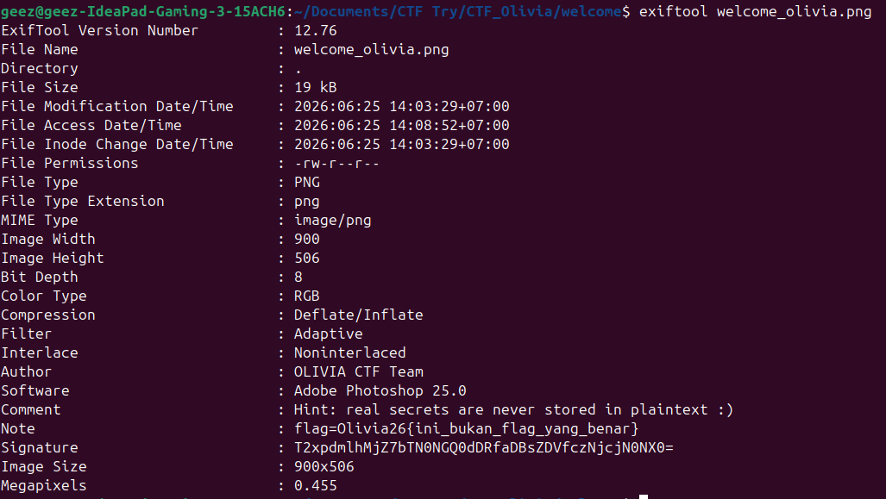
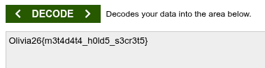

# Welcome Olivia


## Penyelesaian

Dari soal ini kami mendapatkan file bertipe PNG, dan kami menggunakan `exiftool` untuk melihat metadata. Kami mendapatkan enkripsi base64, dan setelah didecode, hasilnya menunjukkan flagnya.





## Flag

Flag didapat dari hasil decode base64 pada metadata file PNG, mengikuti format `Olivia26{...}`.
```
Olivia26{m3t4d4t4_h0ld5_s3ct3t5}
```